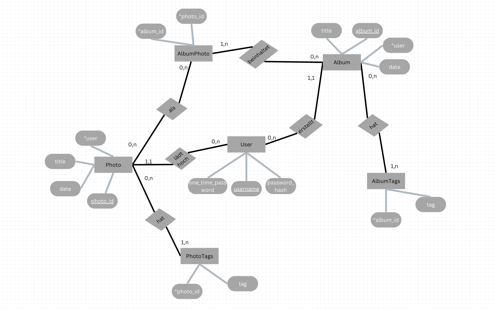

ER Modell:

### Erklärung:
Alle Attribute sind gegeben und entsprechend gekennzeichnet, Primärschlüssel sind unterstrichen und Fremdschlüssel haben ein ^ vor ihnen.
Die Tag Entitäten brauchen jeweils, die entsprechenden IDs als Fremdschlüssel. AlbumFoto braucht beide IDs, da die Entität die Schnittstelle zwischen ihnen darstellt.
#### Beziehungen
Die Tags haben auf ihrer Seite immer eine 1,n Beziehung, da sie zu mindestens einem gehören müssen. Auf der anderen Seite muss ein Foto kein Tag haben, kann aber beliebig viele haben, deswegen 0,n.
Von dem User gehen zwei 0,n Beziehungen aus, da ein User theoretisch keine Alben oder Fotos hinzufügen muss, aber wenn dann beliebig viele.
Auf der Seite von Photo und Album geht jeweils eine 0,n Beziehung zu AlbumFoto aus, denn ein Foto muss nicht in einem Album sein und andererseits kann das Album leer sein.
Zurück geht zu beiden eine 1,n Beziehung, da wenn ein AlbumFoto existiert, dann muss es in einem Album sein(1,n), aber muss nicht außerhalb eines Albums als Photo geben(0,n).